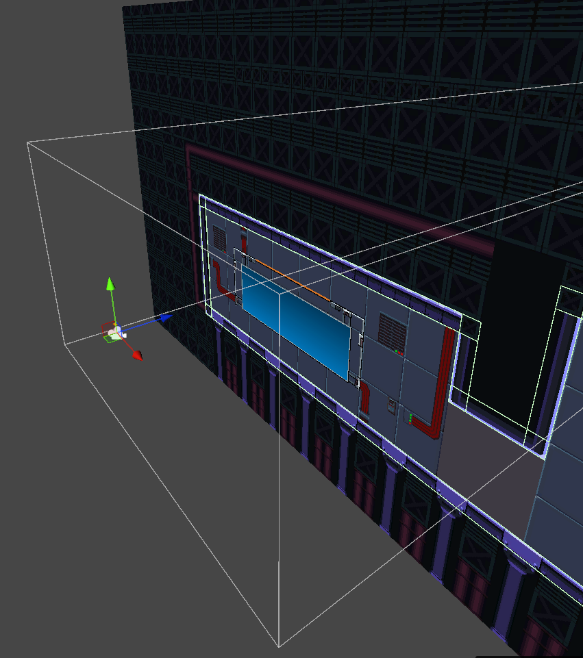
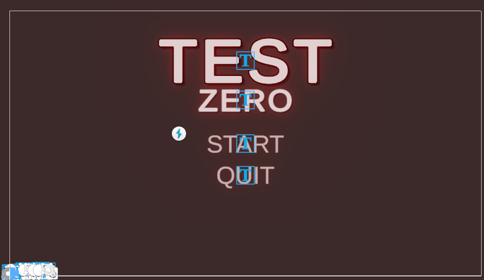

<h1 align="center">
 
    <br />
    Test Zero
    <br />
    유니티 2D 게임 개발 일지
</h1>

## 🌐 View in other languages: [English 🇺🇸](./README.md)

#### 이 저널은 University of Alberta의 INT450 수업의 일환으로 Unity를 사용해 2D 슈팅 게임을 개발하면서 겪었던 여정과 어려움을 다룬 것입니다. 게임 개발, 특히 Unity를 활용한 개발에 관심 있는 분들에게 저희의 경험이 도움이 되기를 바랍니다.

> **참고:** 이 저널에 담긴 내용은 일부가 오래되었거나 최선의 방법이 아닐 수 있습니다. 이 자료는 학습용으로 작성된 것이며, 절대적인 가이드는 아닙니다. 항상 최신 정보를 얻기 위해 Unity 공식 문서와 커뮤니티 자료를 참고하시기 바랍니다.

# 목차

- [목차](#목차)
- [유니티 기초](#유니티-기초)
  - [게임 오브젝트와 컴포넌트](#게임-오브젝트와-컴포넌트)
  - [카메라와 UI](#카메라와-UI)
    - [카메라](#카메라)
      - [시네머신](#시네머신)
    - [UI](#ui)
  - [입력 처리](#입력-처리)
    - [구 입력 시스템](#구-입력-시스템)
    - [새로운 입력 시스템](#새로운-입력-시스템)
  - [최적화](#최적화)
    - [이벤트](#이벤트)
    - [코루틴](#코루틴)
  - [디버깅](#디버깅)
  - [빌드](#빌드)
- [Test Zero의 핵심 포인트](#Test-Zero의-핵심-포인트)
  - [플레이어 컨트롤](#플레이어-컨트롤)
    - [이동 및 조작](#이동-및-조작)
    - [전투 및 스탯](#전투-및-스탯)
  - [적](#적)
    - [공통 행동](#공통-행동)
    - [유연성과 커스터마이징](#유연성과-커스터마이징)
  - [사격](#사격)
    - [투사체 로직](#투사체-로직)
    - [조준](#조준)
  - [절차적 맵 생성](#절차적-맵-생성)
  - [절차적 무기 생성](#절차적-무기-생성)
    - [생성 로직](#생성-로직)
    - [전설 무기](#전설-무기)
    - [재활용 및 상호작용](#재활용-및-상호작용)
  - [애니메이션](#애니메이션)
    - [본 리깅](#본-리깅)
    - [애니메이터](#애니메이터)
  - [2D 조명 및 파티클](#2D-조명-및-파티클)
    - [2D 조명](#2D-조명)
    - [파티클](#파티클)
  - [셰이더](#셰이더)
  - [FMOD](#FMOD)
    - [이산 파라미터 버그](#이산-파라미터-버그)

# 유니티 기초

[처음으로](#목차)

프로그래밍 언어에 대한 경험이 많지 않더라도, 객체 지향 프로그래밍(OOP)에 대해서는 들어본 적이 있을 것입니다. 하지만 Unity를 포함한 많은 게임 엔진에서는 ECS(Entity-Component-System) 개념을 이해하는 것이 도움이 됩니다. 위키백과에 따르면, [“ECS는 데이터로 이루어진 컴포넌트들로 구성된 엔티티와, 이 컴포넌트들을 처리하는 시스템으로 구성된다”고 설명합니다.](https://en.wikipedia.org/wiki/Entity_component_system#:~:text=Entity%E2%80%93component%E2%80%93system%20ECS,which%20operate%20on%20the%20components).

엔티티(Entity)는 게임 내의 객체들을 의미하며, 예를 들어 플레이어나 적과 같은 것들입니다. 컴포넌트(Component)는 해당 엔티티가 어떻게 행동해야 하는지를 정의하는 데이터와 기능으로, 위치, 체력, 수행 가능한 동작 등이 이에 해당합니다. 시스템(System)은 이러한 컴포넌트들을 처리하는 로직입니다. 다시 말해, 시스템은 컴포넌트를 바탕으로 엔티티의 행동을 제어하는 역할을 합니다.

## 게임 오브젝트와 컴포넌트

[처음으로](#목차)

Unity에서 GameObject는 곧 엔티티(Entity) 역할을 합니다. 흥미로운 점은, GameObject가 일종의 폴더처럼 동작할 수 있다는 것입니다.
즉, GameObject를 계층 구조(Hierarchy) 로 구성할 수 있으며, 하나의 GameObject가 여러 자식 GameObject를 가질 수 있습니다. 이를 통해 게임 오브젝트들을 논리적으로 정리하고 구조화할 수 있습니다.

<p align="center">
 
  <br />
  오브젝트 계층 구조
</p>

객체들이 부모-자식 관계로 구성되어 있다는 점에 주목하세요. 이러한 구조는 그룹 단위의 변형(이동, 회전, 크기 조절 등) 을 가능하게 하고, 씬(Scene)의 구성과 관리를 더욱 효율적으로 만들어 줍니다.

<p align="center">
 
  <br />
  씬 구성
</p>

컴포넌트에는 스크립트, 물리 속성, 렌더러 등 다양한 요소가 포함될 수 있습니다.

각 GameObject는 여러 개의 컴포넌트를 가질 수 있으며, 이들 컴포넌트가 해당 오브젝트의 동작과 외형을 정의합니다.
예를 들어, 이 장면(Scene)에서는 각 벽과 천장 오브젝트에 BoxCollider2D 컴포넌트가 포함되어 있어, 게임 월드 내 다른 오브젝트들과의 상호작용이 가능하게 됩니다. 이 BoxCollider는 씬 뷰(Scene View)에서 녹색 윤곽선으로 표시됩니다.

이 오브젝트들은 또한 SpriteRenderer 컴포넌트도 가지고 있지만, 해당 레벨은 배경 및 충돌 오브젝트를 개별 스프라이트 대신 타일 기반 방식으로 시각적으로 구성하고 있기 때문에, 씬에서는 눈에 띄지 않을 수 있습니다.

## 카메라와 UI

카메라는 게임에서의 시점을 담당하며, 화면에 어떤 것이 보일지를 결정합니다.
UI(사용자 인터페이스)는 메뉴, 버튼, HUD(헤드업 디스플레이)와 같이 플레이어가 게임과 상호작용할 수 있도록 도와주는 시각적 요소들입니다.

### 카메라

[처음으로](#목차)

<p align="center">
 
  <br />
  씬 뷰(왼쪽)와 2D 보기 상태의 게임 뷰(오른쪽).
</p>

씬 뷰에서 흰색 윤곽선은 카메라의 뷰포트를 나타내며, 게임 뷰에 어떤 화면이 보일지를 보여줍니다. 게임 뷰는 실제 플레이어가 보게 될 게임 화면을 표시합니다.

<p align="center">
 
  <br />
  3D 보기 상태의 씬 뷰.
</p>

본 게임은 2D이지만, 카메라의 시점이 게임 월드를 어떻게 보여주는지 고려해야 할 필요가 있습니다. 때로는 디버깅이나 레벨 디자인을 할 때, 카메라 시점을 바꿔보는 것이 게임이 다양한 각도에서 어떻게 보이는지를 확인하는 데 도움이 됩니다.

#### 시네머신

[처음으로](#목차)

[시네머신](https://unity.com/features/cinemachine) 은 Unity에서 제공하는 강력한 패키지로, 고급 카메라 제어와 다양한 기능을 지원합니다. 많은 코드를 작성하지 않고도 복잡한 카메라 동작을 쉽게 구현할 수 있습니다.

<p align="center">
    
    <br />
    시네머신 카메라 전환
</p>

우선순위(Priority)가 다른 여러 개의 시네머신 카메라를 추가하면, 플레이어의 행동이나 게임 이벤트에 따라 카메라를 전환할 수 있습니다. 예를 들어, 플레이어를 따라다니는 카메라, 특정 구역을 비추는 카메라, 컷신 동안 영화 같은 연출을 위한 카메라 등을 각각 설정할 수 있습니다.

### UI

[처음으로](#목차)

<p align="center">
 
  <br />
  씬 뷰(왼쪽)와 게임 뷰(오른쪽).
</p>

다음은 간단한 UI 버튼 설정의 예시입니다. 흥미로운 점은 이러한 UI 요소들이 씬 뷰에서는 보이지 않지만, 게임 뷰에서는 보인다는 것입니다. 이는 UI 요소들이 게임 월드 위에 렌더링되기 때문이며, 플레이어가 게임 오브젝트에 방해받지 않고 UI와 상호작용할 수 있도록 해줍니다.

<p align="center">
 
  <br />
    카메라가 줌 아웃된 상태의 씬 뷰
</p>

씬 뷰를 축소해보면, UI 요소들이 카메라를 기준으로 어떻게 배치되어 있는지 확인할 수 있습니다.

<p align="center">
 
  <br />
    오버레이
</p>

다음은 플레이어의 체력과 탄약을 표시하는 UI 오버레이의 예시입니다. 이 오버레이는 화면의 왼쪽 상단에 배치되어 있으며, 플레이어가 피해를 입거나 탄약을 사용할 때마다 실시간으로 업데이트됩니다.

## 입력 처리

Unity에서 사용자 입력을 처리하는 주요 방법은 두 가지가 있습니다: **구 입력 시스템**과 **새로운 입력 시스템**입니다.

### 구 입력 시스템 

[처음으로](#목차)

구 입력 시스템은 매우 간단하고 사용하기 쉽습니다.

```csharp
public class OldInputSystem : MonoBehaviour
{
    void Update()
    {
        if (Input.GetKeyDown(KeyCode.Space))
        {
            Debug.Log("Space key was pressed");
        }
        if (Input.GetKey(KeyCode.Space))
        {
            Debug.Log("Space key was pressed");
        }
    }
}
```

사용자 입력을 처리하는 방법 중 하나는 Update() 메서드를 사용하는 것입니다. 이 메서드는 매 프레임마다 한 번씩 호출됩니다.

예를 들어, Input.GetKeyDown()은 해당 프레임에서 키가 눌린 순간을 감지하고, Input.GetKey()는 키가 누르고 있는 상태를 계속 감지합니다.즉, 스페이스 키를 누르고 있으면 Input.GetKeyDown()은 한 번만 로그를 출력하고, Input.GetKey()는 키를 떼기 전까지 매 프레임마다 로그를 출력합니다.

구 입력 시스템에서 이 외의 입력 처리 방식이 있는지는 확실하지 않지만, Update() 기반의 방식은 상황에 따라 성능 문제가 발생할 수 있으므로 주의가 필요합니다.

### 새로운 입력 시스템

[처음으로](#목차)

새로운 입력 시스템(New Input System)은 사용자 입력을 더 유연하고 효율적으로 처리할 수 있는 방법을 제공합니다.
Update() 메서드에서 입력을 확인하는 대신, 이벤트를 사용하여 사용자 입력에 반응할 수 있습니다.
이 방법은 입력을 더 효율적으로 처리할 수 있게 하며, 지속적인 폴링의 필요성을 줄여줍니다.

이러한 용어들을 이해하면 새로운 입력 시스템을 사용하는 데 도움이 됩니다:

* **Subscription**: 입력 액션이 트리거될 때 호출할 메서드를 등록하는 방식입니다.

* **Action**: "Jump"나 "Fire"와 같은 특정 입력 동작을 나타냅니다. 액션은 여러 입력 장치(키보드, 게임패드 등)에 바인딩될 수 있습니다.

* **Action Map**: 관련된 액션들을 하나로 묶은 그룹입니다.

* **Input Action Asset**: 입력 액션과 해당 바인딩을 정의하는 파일입니다.


<p align="center">
 
  <br />
    Input Action Asset
</p>

Input Action Asset은 입력 동작과 해당 키 또는 버튼 조합(바인딩)을 정의하는 파일입니다.
하나의 Input Action Asset 안에는 여러 개의 액션 맵을 포함할 수 있으며, 이를 통해 게임의 다양한 상황(예: 게임 플레이, 메뉴 탐색)에 따라 입력 동작을 체계적으로 구성할 수 있습니다.

위 예시에서는 "Player"와 "UI"라는 두 개의 액션 맵이 있습니다.
"Player" 액션 맵에는 이동, 점프, 사격 등의 동작이 포함되어 있고,
"UI" 액션 맵에는 메뉴를 탐색하는 동작들이 들어 있습니다.

이처럼 여러 액션 맵을 사용하는 목적은 게임의 현재 상황에 따라 서로 다른 입력 동작 세트를 전환할 수 있게 하기 위함입니다.
하지만, 단순함을 원한다면 모든 입력 동작을 하나의 액션 맵 안에서 관리할 수도 있습니다.

## 최적화

Unity 게임의 성능을 향상시키기 위한 여러 가지 최적화 방법이 있습니다. 아래는 유용했던 팁 중 일부입니다:

Update() 메서드는 매 프레임마다 호출되므로, 과도하게 사용하면 성능 저하로 이어질 수 있습니다. 대신, 입력 처리나 시간에 민감한 작업에는 이벤트나 코루틴(Coroutine)을 사용하는 것이 좋습니다.

### 이벤트

[처음으로](#목차)

플레이어가 어떤 오브젝트에 가까이 다가갔을 때마다 코드를 실행하고 싶다고 가정해봅시다.

```csharp
void Update()
    {
        if (Player != null)
        {
            float distance = Vector3.Distance(Player.transform.position, transform.position);
            if (distance < 5f)
            {
                Debug.Log("Player is close to the object.");
            }
        }
    }
```

Update() 메서드를 사용하면 매 프레임마다 거리를 계산하게 됩니다. 씬에 많은 오브젝트가 있고, 각 오브젝트에 이 스크립트가 붙어 있다면 성능 문제가 발생할 수 있습니다.

Update() 안의 로직이 복잡할수록 성능 저하가 더 심해질 수 있습니다.

이때 자주 사용하는 컴포넌트 중 하나가 Collider입니다. Collider는 오브젝트 간의 충돌을 감지할 수 있도록 도와줍니다.

```csharp
void OnCollisionEnter2D(Collision2D collision)
    {
        if (collision.gameObject.CompareTag("Player"))
        {
            // Perform the desired action when the player collides with this object
            Debug.Log("Player collided with the Opt object.");
        }
    }
```

충돌을 감지하기 위해 OnCollisionEnter2D() 메서드를 사용할 수 있습니다.
이 메서드는 충돌이 발생했을 때에만 호출되므로, 매 프레임마다 계산을 수행하는 것보다 성능이 훨씬 효율적입니다.
이러한 방식은 불필요한 연산을 줄여주어 게임 최적화에 도움이 됩니다.

### 코루틴

[처음으로](#목차)

[Unity의 공식 문서](https://learn.unity.com/tutorial/coroutines#yLp09thJhNvnon365AImrC)에 따르면, “코루틴(Coroutine)은 일정 시간 지연 후에 실행되거나, 시간이 흐름에 따라 발생해야 하는 작업을 손쉽게 관리할 수 있는 훌륭한 방법입니다.
코루틴을 사용하면 동일한 결과를 다른 방식으로 구현할 때 필요했던 타이머나 복잡한 처리 로직으로 인해 Update 메서드가 과도하게 비대해지는 것을 방지할 수 있습니다.”

<p align="center">
    
    
    <br />
    일반 스포트라이트 (좌측) 와 코루틴을 사용한 스포트라이트 (우측)
</p>

Update() 메서드를 사용해도 동일한 효과를 얻을 수는 있지만, 코루틴을 사용하는 것이 코드 관리 측면에서 더 간편합니다.

```csharp
public class SpotLightController : MonoBehaviour
{
    [SerializeField] private float _time = 3f;
    [SerializeField] private float _rotationAngle = 30f;
    [SerializeField] private bool _rotateLeft = true;
    private Transform _lightHead;

    private void Awake()
    {
        _lightHead = transform.GetChild(0);
        StartCoroutine("RotateLightHead");
    }
}
```

스크립트가 초기화되자마자 "RotateLightHead" 코루틴이 시작됩니다.
이 코루틴은 백그라운드에서 실행되며, 라이트 헤드를 계속해서 회전시키는 역할을 합니다.

```csharp
IEnumerator RotateLightHead()
    {
        while (true)
        {
            int direction = _rotateLeft ? 1 : -1;
            
            // First rotation
            yield return RotateByAngle(direction * _rotationAngle);
            // Return to origin
            yield return RotateByAngle(-direction * _rotationAngle);

            // Second rotation (opposite direction)
            yield return RotateByAngle(-direction * _rotationAngle);
            // Return to origin
            yield return RotateByAngle(direction * _rotationAngle);
        }
    }

IEnumerator RotateByAngle(float angle)
    {
        float startAngle = _lightHead.localRotation.eulerAngles.z;
        if (startAngle > 180f) startAngle -= 360f; // Normalize angle
        float targetAngle = startAngle + angle;
        float elapsedTime = 0f;

        while (elapsedTime < _time)
        {
            float currentAngle = Mathf.Lerp(startAngle, targetAngle, elapsedTime / _time);
            _lightHead.localRotation = Quaternion.Euler(0f, 0f, currentAngle);
            elapsedTime += Time.deltaTime;
            yield return null;
        }

        _lightHead.localRotation = Quaternion.Euler(0f, 0f, targetAngle);
    }
```

RotateByAngle은 라이트 헤드를 지정된 각도만큼 일정 시간에 걸쳐 회전시키는 코루틴입니다.

## 디버깅

[처음으로](#목차)

<p align="center">
 
 
 <br />
    콘솔 탭
</p>

Console 탭은 Unity 게임을 디버깅할 때 매우 유용한 도구입니다.
이 탭에서는 스크립트에서 생성된 로그 메시지, 경고, 오류 등을 확인할 수 있습니다.
Console 탭이 보이지 않는 경우, **Window > Panels > Console** 경로를 통해 열 수 있습니다.

```csharp
Debug.Log("This is a log message."); // White text in the console
Debug.LogWarning("This is a warning message."); // Yellow text in the console
Debug.LogError("This is an error message."); // Red text in the console
```

위와 같이 로그 메시지를 출력할 수 있습니다.
경고(Warning)는 치명적인 문제는 아니지만, 향후 게임에 영향을 줄 수 있는 잠재적인 문제를 나타냅니다.
반면 오류(Error)는 해결되기 전까지 게임이 실행되지 않도록 막는 원인이 됩니다.

코드에 오류가 있으면 콘솔에 표시되며, 디버깅의 첫 단계는 이 디버그 메시지를 확인하는 것입니다.

Unity의 콘솔은 **빌드 모드에서는 사용할 수 없기** 때문에, 우리는 메시지를 확인하기 위해 [인게임 디버그 콘솔](https://assetstore.unity.com/packages/p/in-game-debug-console-68068)을 사용했습니다.

<p align="center">
 
 <br />
    Development Build 옵션
</p>

빌드할 때 **Development Build** 옵션을 활성화하면, 빌드된 게임에서도 콘솔을 확인할 수 있습니다.
(개인적으로는 메시지를 필터링할 수 있기 때문에 인게임 디버그 콘솔을 더 선호합니다.)

## 빌드

[처음으로](#목차)

게임이 **Unity 에디터**에서는 완벽하게 작동하더라도, **빌드**한 후에는 예상대로 동작하지 않을 수 있습니다.
심한 경우, 치명적인 오류로 인해 아예 실행되지 않는 경우도 있습니다.

<p align="center">
 
 
  <br />
    스크립트 실행 순서
</p>

일부 오류, 특히 널 참조 오류는 **스크립트 실행 순서(Script Execution Order)** 문제로 인해 발생할 수 있습니다.
이 순서는 **Edit > Project Settings > Script Execution Order**에서 조정할 수 있습니다.

스크립트가 올바른 순서로 초기화되도록 하면 오류를 방지할 수 있으며, 특히 스크립트 간에 의존성이 있을 때(예: **싱글톤 패턴**을 사용할 때) 중요합니다.

# Test Zero의 핵심 포인트

## 플레이어 컨트롤

**PlayerController** 스크립트는 플레이어의 이동, 체력, 입력, 특수 능력 등 핵심 게임플레이 메커니즘 대부분을 처리합니다.

### 이동 및 조작

[처음으로](#목차)

**기본 이동**: 방향 이동, 달리기, 후방 걷기, 점프, 공중 회피 등을 포함합니다.

**회피 시스템**: 상태에 따라 다른 애니메이션과 이동 거리 적용 (지상, 후방 걷기, 공중). 회피 중에는 무적 시간도 포함됩니다.

**코요테 타임**: 땅에서 떨어진 직후 짧은 유예 시간을 두어, 더 반응성 높은 점프가 가능하도록 합니다.

### 전투 및 스탯

[처음으로](#목차)

**총기 메커니즘**: 발사 속도, 재장전 속도, 탄 퍼짐, 탄약, 탄 종류(예: 탄환 튕김, 관통 등)를 관리합니다.

**슬로우 모션(Bullet Time)**: 별도의 게이지를 사용해 일정 시간 동안 전역 시간을 느리게 만듭니다. 이때 플레이어의 속도와 애니메이션도 함께 조정됩니다.

**데미지 시스템**: 플레이어가 데미지를 입거나 회복할 수 있으며, 시각/청각 피드백과 함께 일시적인 무적 상태(i-frame)를 제공합니다.

> 이 컨트롤러는 플레이어 관련 게임플레이의 중심 허브 역할을 하며, 반응성 높은 조작, 역동적인 전투, 오디오 및 UI와의 통합을 가능하게 합니다.

## 적

여러 종류의 적을 효율적으로 관리하기 위해 우리는 **EnemyBase.cs**라는 추상 기본 클래스를 만들었습니다.
보스를 포함한 총 6종의 적들은 모두 이 클래스를 상속받으며, 이를 통해 **체력**, **데미지 처리**, **사망 처리** 등의 공통 로직을 공유할 수 있습니다.

### 공통 행동

[처음으로](#목차)

**체력 관리**: 각 적은 최대 체력(maxHealth), 현재 체력(currentHealth), 그리고 사망 시 보상으로 주어지는 자원(resourceAmount)을 가집니다.

**데미지 처리**: 즉시 피해와 시간에 따른 피해(도트 피해)를 모두 지원합니다.

**상태 이상 효과**: 부식 효과와 같은 탄환 속성에서 유래한 상태 이상을 처리합니다.

### 유연성과 커스터마이징

[처음으로](#목차)

적들은 `Die()` 같은 메서드를 오버라이드하여 행동을 커스터마이즈할 수 있습니다. (예: 고유한 사망 애니메이션 재생 등)

`Smite()`나 `ZeroResourceAmount()` 같은 유틸리티 함수는 스크립트 기반 처형이나 보상 비활성화에 사용됩니다.

또한 각 적은 자신만의 고유한 행동 또는 능력 로직을 가질 수 있어, **공통 기반에는 영향을 주지 않으면서 AI를 자유롭게 커스터마이즈**할 수 있습니다.
예를 들어, 어떤 적은 소환수를 부르거나, 체력에 따라 공격 패턴을 바꾸는 등의 동작이 가능합니다.

> 이 시스템을 통해 핵심 로직을 중앙에서 유지하면서도, 새로운 적 유형을 쉽게 만들 수 있습니다.

## 사격
사격 시스템은 탄환의 동작, 무기 속성, 조준 로직을 결합하여 반응성 높고 유연한 전투 메커니즘을 구성합니다.

### 투사체 로직

[처음으로](#목차)

각 탄환은 고유의 속도, 방향, 수명, 데미지를 가진 독립된 오브젝트입니다.
적에게 명중하면 데미지를 가하고, 탄환 유형에 따라 **회복**, **부식 데미지(DoT)**, **콤보 보너스** 등의 효과를 추가로 발동시킬 수 있습니다.

**명중 판정**: `OnTriggerEnter2D`를 사용해 적과의 충돌을 감지합니다.

**시각적 피드백**: 히트마커와 데미지 숫자를 화면에 표시합니다.

**탄환 유형**: 튕기는 탄환, 관통탄, 생명력 흡수, 부식, 추적, 콤보 탄 등 다양한 종류가 있으며,
각 탄환은 고유한 동작을 합니다 (예: 벽에 튕기거나 적을 추적).

### 조준

[처음으로](#목차)

Aim 스크립트는 마우스 위치를 기준으로 팔과 머리의 회전을 제어합니다.
또한 플레이어 스프라이트를 올바른 방향으로 뒤집어 조준 시각이 정확하고 자연스럽게 유지되도록 합니다.

**머리 & 팔 추적**: 일시정지 상태가 아닐 경우, 마우스 위치를 실시간으로 추적합니다.

**스프라이트 뒤집기**: 플레이어가 커서 방향을 바라보도록 스프라이트 방향을 조정합니다.

**각도 제한**: 비현실적인 머리 회전을 방지하기 위해 회전 각도를 제한합니다.

> 이 시스템을 통해 핵심 구조에 큰 변경 없이도 다양한 사격 동작을 구현할 수 있습니다.


## 절차적 맵 생성

[처음으로](#목차)

[절차적 컨텐츠 생성](https://en.wikipedia.org/wiki/Procedural_generation)은 게임 콘텐츠를 수동으로 제작하는 대신, 알고리즘을 통해 자동으로 생성하는 방법입니다. 
Test Zero에서는 게임이 실행될 때마다 **절차적 맵 생성** 시스템을 통해 매번 다른 형태의 레벨을 만들어냅니다.

<p align="center">
 
 
  <br />
  절차적 맵 생성을 위한 맵 구성 요소들
</p>

PCG(Procedural Content Generation, 절차적 콘텐츠 생성)은 게임 콘텐츠를 수작업이 아닌 알고리즘을 통해 생성하는 기법입니다.
하지만 알고리즘이 따를 수 있도록 **명확한 규칙**을 정해줘야 합니다.

절차적 생성을 위해, **수작업으로 제작된 맵 조각들**이 기본 단위로 사용됩니다.
각 맵 조각은 서로 자연스럽게 이어질 수 있도록 설계되어 있어, 다양한 조합이 가능하게 됩니다.

모든 맵 조각이 준비되고 규칙이 정의되면, 절차적 생성 알고리즘은 게임이 실행될 때마다 **고유한 맵 구조**를 만들어냅니다.


<p align="center">
 
  <br />
  맵 구성요소들의 경계 체크하기
</p>

구성요소들이 올바르게 이어지도록 하기 위해, 각 요소의 경계(Boundary)를 검사합니다.
이 과정에서는 세그먼트가 볼록 다각형(Convex Polygon)인지 확인하고, 서로 겹치는지 여부를 검사합니다.
겹치지 않는다면, 두 세그먼트를 빈틈 없이 나란히 배치할 수 있습니다.

<p align="center">
 
  <br />
  절차적 맵 생성 으로 완성된 레벨
</p>

절차적 생성(PCG)은 강력한 기법이지만, 구현하기가 쉽지는 않습니다.
생성된 콘텐츠가 재미있고 몰입감 있게 느껴지도록 하려면 신중한 기획과 설계가 필요합니다.

> 절차적 콘텐츠 생성의 한가지 예로는 [The Classrooms](https://store.steampowered.com/app/2099110/The_Classrooms/)가 있습니다. 이 게임은 수작업으로 제작된 맵 조각과 알고리즘 기반 생성을 혼합하여, 플레이할 때마다 새로운 맵 구성을 만들어냅니다.
이러한 방식은 재플레이성과 다양성을 높이면서도, 정교하게 설계된 게임 경험을 유지할 수 있다는 것을 보여줍니다.

## 절차적 무기 생성

[처음으로](#목차)

<p align="center">
 
  <br />
  절차적으로 생성된 무기
</p>

플레이어가 게임을 반복해서 즐길 수 있도록 다양성을 높이기 위해, 이 게임에는 절차적 무기 생성 시스템이 도입되어 있습니다.
이 시스템은 무기의 능력치, 외형, 희귀도를 무작위로 조합하여 매번 다른 무기를 생성합니다.

### 생성 로직

무기는 플레이어가 상호작용할 수 있는 **GunCreate 스테이션**을 통해 생성됩니다.
생성된 각 무기는 다음과 같은 속성을 가집니다:

**희귀도 티어**: 커먼, 언커먼, 레어, 레전더리

**부품 레벨**: 총열, 프레임, 탄창 부품의 레벨이 무작위로 분배되며, 최대 티어 범위 내에서 결정됩니다.

**그립 타입**: 기본 능력치(예: 데미지, 연사 속도)를 결정합니다.

**탄환 종류**: 희귀도에 따라 특수 탄환이 추가되며, 전투 방식에 영향을 줍니다 (예: 생명력 흡수, 추적 탄환 등).

또한, **천장 시스템**이 적용되어 일정 횟수마다 고등급 무기가 반드시 등장합니다
(예: 20개 생성 시 1개는 반드시 전설 무기).


### 전설 무기

레전더리 무기는 별도의 데이터 구조(**LegendaryGunData**)로 정의되며,
절차적으로 생성되지 않고 **수작업으로 설정된 능력치**와 **고유한 탄환 종류**를 가집니다.
이들은 일반 무기처럼 무작위로 굴려지는 것이 아니라, 특별히 설계된 전용 무기입니다.

### 재활용 및 상호작용

무기는 희귀도에 따라 일부 자원을 환급받으며 **재활용**할 수 있습니다.

플레이어는 **상호작용 버튼을 길게 누르면 여러 개의 무기**를 한꺼번에 생성할 수 있습니다.

총 위에 커서를 올리면 **스탯 패널과 시각적 요소가 실시간으로 업데이트**되어 정보를 확인할 수 있습니다.

> 이 시스템은 무기의 다양성을 제공하면서도, 생성 규칙을 **통제 가능하고 확장성 있게 유지**합니다.

## 애니메이션

[처음으로](#목차)

<p align="center">
 
  <br />
  본
</p>

부드러운 캐릭터 움직임을 만들고 프레임 단위 스프라이트의 필요를 줄이기 위해, Unity의 내장 **2D Animation 패키지**를 활용한 **2D 스켈레탈 애니메이션**을 사용했습니다.


### 본 리깅

캐릭터는 몸통, 팔, 다리 등 **여러 스프라이트 파츠**로 구성되며, 이들은 **뼈대 계층 구조**를 통해 연결되어 있습니다.
각 뼈(Bone)는 특정 신체 부위를 제어하며, 이를 통해 걷기, 점프, 조준과 같은 **부드럽고 재사용 가능한 애니메이션**을 만들 수 있습니다.


### 애니메이터

<p align="center">
 
  <br />
  애니메이터
</p>

대기, 걷기, 점프, 회피와 같은 애니메이션은 Unity의 **Animator Controller**를 통해 관리되며, 상태 전환(State Transition)을 이용해 부드러운 애니메이션 흐름을 만듭니다.

> 이 구성은 최소한의 스프라이트 자산으로 **재사용 가능한 애니메이션**을 구현할 수 있게 해주며, **일관된 모션 품질**을 유지할 수 있습니다.


## 2D 조명 및 파티클
조명과 파티클을 탐색할 때, 이는 게임의 분위기와 플레이어 경험을 향상시키는 시각 효과(VFX)에 해당합니다.
2D 조명을 적절히 활용하면 감정적인 분위기를 조성하고, 중요한 게임플레이 요소를 강조하며, 씬에 깊이감을 더할 수 있습니다.
파티클 시스템은 사격, 폭발, 환경 효과 등 다양한 행동에 대한 역동적인 피드백을 제공하여, 게임 월드를 더욱 생동감 있고 반응성 있게 만들어줍니다.

시각 효과에 관해서는, [포스트 프로세싱(Post Processing)](https://docs.unity3d.com/6000.1/Documentation/Manual/PostProcessingOverview.html)도 고려하는 것이 중요합니다.
포스트 프로세싱을 통해 블룸(Bloom), 컬러 그레이딩(Color Grading), 모션 블러(Motion Blur) 같은 효과를 적용하여 게임의 비주얼을 한층 강화할 수 있습니다.
이러한 기술은 게임의 분위기와 완성도를 크게 높일 수 있지만, 이 저널에서는 다루지 않습니다.

### 2D 조명

[처음으로](#목차)

Unity의 2D 조명은 3D 조명보다 간소화된 방식으로, **2D 프로젝트에 최적화된 사용 편의성**을 제공합니다.
기본적으로 2D 조명은 스프라이트의 **색상과 알파값**에 영향을 주지만, **빛의 방향**을 시뮬레이션하거나 **그림자를 생성하지는 않습니다**.
보다 고급스러운 효과(예: 사실적인 음영 표현이나 그림자 생성)를 구현하려면 **커스텀 셰이더**나 **스프라이트 조정** 등의 추가적인 기법이 필요합니다.
예시는 [이 유튜브 영상](https://www.youtube.com/watch?v=1h-hSlffawM&t=225s)에서 확인할 수 있습니다.

텍스처가 조명과 어떻게 상호작용하는지 이해하는 것도 중요합니다.
**그라디언트**나 **그림자 표현이 포함된 스프라이트**는 2D 조명의 영향을 더 잘 반영하여, 더욱 시각적으로 매력적인 씬을 연출할 수 있습니다.

### 파티클

[처음으로](#목차)

파티클은 총알 충돌, 폭발, 환경 요소 등과 같은 시각적 효과를 표현하는 데 사용됩니다.
Unity의 파티클 시스템(Particle System)은 성능에 큰 부담을 주지 않으면서도 **복잡한 효과를 손쉽게 구현**할 수 있도록 도와줍니다.

<p align="center">
 
  <br />
    치유 파티클
</p>

플레이어가 체력 아이템을 획득했을 때, **플레이어 주변에 파티클이 생성되며 회복 효과**를 표현합니다.

<p align="center">
 
  <br />
    2D 조명과 스파크 파티클
</p>

Unity의 기본 파티클 시스템은 2D 라이트(Light2D)를 기본적으로 지원하지 않습니다.
Unity 6 (2025년 기준)에서도 이 제한은 여전히 존재하며, [Unity는 파티클 시스템에 Light2D 지원을 추가할 계획이 없다고 밝혔습니다](https://discussions.unity.com/t/lwrp-using-2d-lights-in-a-particle-system-emitter/752498/45) (2023년 마지막 업데이트 기준).

```c#
// This script is a workaround to add Light2D to each particle in the Particle System

void LateUpdate()
    {
        int count = m_ParticleSystem.GetParticles(m_Particles);

        while (m_Instances.Count < count)
            m_Instances.Add(Instantiate(m_Prefab, m_ParticleSystem.transform));

        bool worldSpace = (m_ParticleSystem.main.simulationSpace == ParticleSystemSimulationSpace.World);
        for (int i = 0; i < m_Instances.Count; i++)
        {
            if (i < count)
            {
                if (worldSpace)
                    m_Instances[i].transform.position = m_Particles[i].position;
                else
                    m_Instances[i].transform.localPosition = m_Particles[i].position;
                m_Instances[i].SetActive(true);
            }
            else
            {
                m_Instances[i].SetActive(false);
            }
        }
    }
```

이 코드는 파티클 시스템에서 Light2D를 기본적으로 지원하지 않는 문제를 해결하기 위한 Unity 커뮤니티의 우회 방법으로 제안된 것입니다.
각 파티클마다 Light2D 프리팹을 인스턴스화하고, 해당 파티클의 위치에 맞춰 배치함으로써 2D 조명이 적용된 것처럼 보이게 만듭니다.
이 방식은 **2D 라이트가 파티클에 적용된 듯한 착시 효과**를 줄 수 있지만, **파티클 수가 많을 경우 성능에 영향을 줄 수 있으므로 주의가 필요**합니다.


<p align="center">
 
  <br />
    성능 문제 – Light2D를 포함한 파티클 시스템
</p>

각 파티클 시스템은 다수의 파티클을 생성하며, 각 파티클에 Light2D 컴포넌트가 부착되어 있습니다.
이 방식으로 테스트해본 결과, 특히 여러 파티클 시스템이 동시에 작동할 때 **심각한 성능 저하**가 발생했습니다.
파티클마다 Light2D를 인스턴스화하고 관리하는 데 드는 부하가 커서, **프레임 저하**와 **게임의 끊김 현상(스터터링)**이 나타날 수 있는것으로 보입니다.

```c#
// This script is a compromised solution to add Light2D to a Particle System without overwhelming the system with too many Light2D instances

void LateUpdate()
    {
        int particleCount = m_ParticleSystem.GetParticles(m_Particles);
        if (particleCount == 0)
        {
            return;
        }

        // Calculate the average position of all particles
        Vector3 averagePosition = Vector3.zero;
        float totalLifetime = 0f;
        float totalRemainingLifetime = 0f;


        for (int i = 0; i < particleCount; i++)
        {
            averagePosition += m_Particles[i].position;
            totalLifetime += m_Particles[i].startLifetime;
            totalRemainingLifetime += m_Particles[i].remainingLifetime;
        }
        averagePosition /= particleCount;
        m_LightInstance.transform.SetParent(m_ParticleSystem.transform);

        bool worldSpace = (m_ParticleSystem.main.simulationSpace == ParticleSystemSimulationSpace.World);
        if (worldSpace)
            m_LightInstance.transform.position = averagePosition;
        else
            m_LightInstance.transform.localPosition = averagePosition;

        // Adjust intensity based on remaining lifetime percentage
        float lifetimeRatio = totalRemainingLifetime / totalLifetime;
        light2D.intensity = Mathf.Lerp(0f, 1f, lifetimeRatio); // Adjust the max intensity as needed

        // Activate light
        m_LightInstance.SetActive(true);
    }
```

저희가 사용한 해결책은 **파티클 시스템당 Light2D 컴포넌트를 하나만 사용하는 것**이었고,
이 Light2D의 강도(Intensity)와 범위(Range)를 파티클의 전체적인 동작에 따라 동적으로 조절하는 방식이었습니다.
이 접근법은 **시각적으로 만족스러운 효과를 제공하면서도**,
모든 파티클에 Light2D를 붙였을 때 발생하던 **성능 문제를 효과적으로 피할 수 있었습니다**.

2D 조명과 파티클은 독특한 시각 효과를 만들어낼 수 있지만, Unity에서는 3D 프로젝트가 더 많은 **유연성과 기능 지원**을 제공합니다.
2D 워크플로우의 제약(예: 제한된 조명 옵션, 파티클 시스템과의 통합 문제 등)을 피하고 싶다면,
Unity의 **조명 및 VFX 시스템이 더 강력하게 지원되는 3D 프로젝트에 집중**하는 것도 좋은 선택일 수 있습니다.


## 셰이더

[처음으로](#목차)

셰이더(Shader)는 GPU에 그래픽을 어떻게 렌더링할지 지시하는 스크립트입니다.
셰이더는 오브젝트의 **색상**, **텍스처**, **효과** 등을 포함해 **화면에 어떻게 그려질지**를 제어합니다.

<p align="center">
 
 
  <br />
    용암 셰이더
</p>

저희는 용암 셰이더를 만드는 실험도 진행했습니다.
플레이어가 용암을 건널 수 있도록 하는 **뗏목 구조물** 또한 추가했습니다.

시각적인 효과를 위해 `Noise` 텍스처를 사용하여 **흐르는 용암의 외형**을 시뮬레이션하였으며,
([튜토리얼](https://www.youtube.com/watch?v=6Yloso8vTQ0)).
또한 `UV 왜곡(Distortion)`을 적용해 표면이 움직이는 듯한 효과를 주어,
용암이 실제로 흐르는 것처럼 보이도록 만들었습니다
([참고 영상](https://www.youtube.com/watch?v=2KSLO9JnxHA)).


## FMOD

[처음으로](#목차)

FMOD는 Unity와 원활하게 통합되는 강력한 오디오 미들웨어로, **실시간 믹싱**, **공간화(Spatialization)**, **동적 이벤트 제어**와 같은 고급 오디오 기능을 제공합니다.

우리는 FMOD를 선택한 이유로, 게임플레이에 반응하는 **적응형 음악**이나 **상황에 따라 달라지는 효과음** 등 복잡한 오디오 시나리오를 유연하게 처리할 수 있다는 점을 들 수 있습니다.
FMOD의 **이벤트 기반 워크플로우**는 플레이어 행동(예: 무기 타입 전환)에 따라 사운드를 간단하게 트리거하고 관리할 수 있게 해줍니다.

모든 FMOD 기능을 활용한 것은 아니지만, FMOD는 오디오를 **체계적으로 구성하고 커스터마이징**하는 데 매우 유용했으며,
결과적으로 작업 효율과 게임의 전체적인 사운드 경험을 향상시키는 데 큰 도움을 주었습니다.


### 이산 파라미터 버그

<p align="center">
 
  <br />
    FMOD의 이산 파라미터
</p>

총기 종류가 변경될 때마다 `RuntimeManager.StudioSystem.setParameterByName("GunType", gunType);`를 호출하여 FMOD 파라미터를 업데이트합니다.
하지만 FMOD에는 **이 파라미터가 이산 값(discrete value)으로 설정될 때 사운드가 즉시 변경되지 않는 버그**가 존재합니다.

<p align="center">
 
 
  <br />
    중첩 이벤트 (이산 파라미터)
</p>

이 버그의 원인은 정확히 알 수 없지만, FMOD 커뮤니티에서는 [이벤트 중첩(Nesting events)](https://qa.fmod.com/t/prevent-retriggering-of-sound-during-parameter-change/15778) 방식을 해결책으로 제시했습니다.

