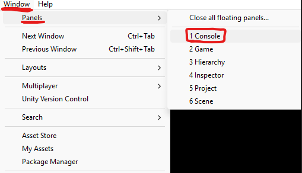
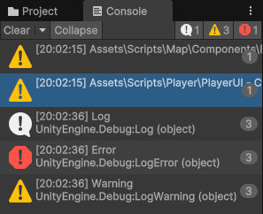
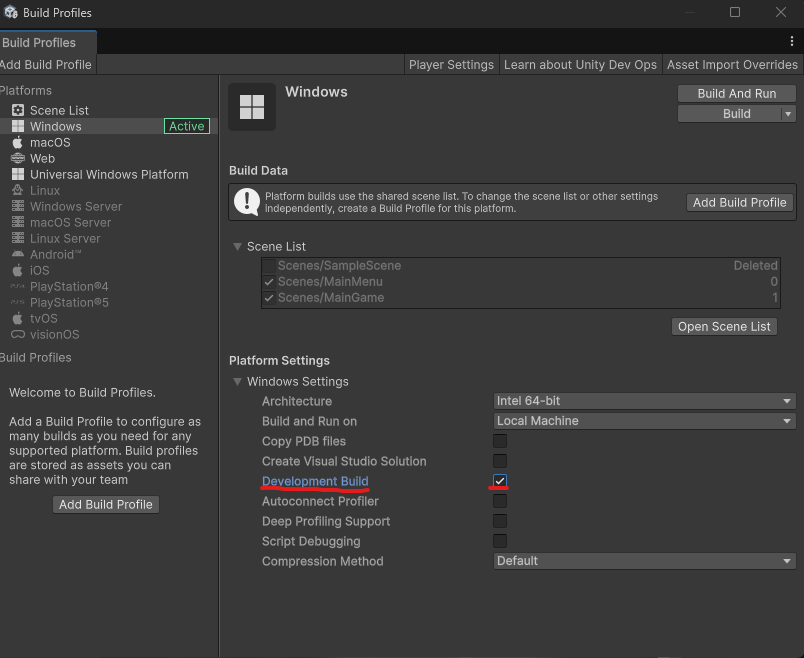
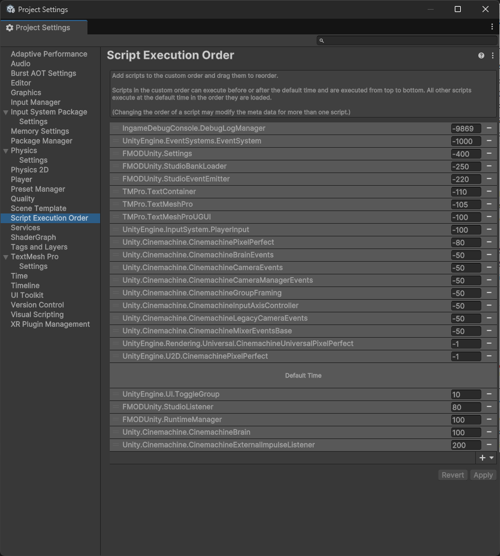
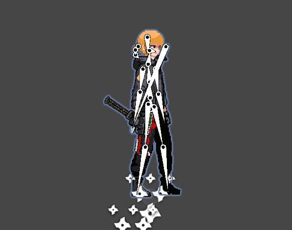

<h1 align="center">
 
    <br />
    Test Zero
    <br />
    2D Unity Game Development Journal
</h1>

#### The journal will explore the path and hardships we experienced throughout the development of a 2D shooter with Unity. We hope it will help whoever is interested in game development, especially with Unity, to learn from our experiences.

> **Note:** Anything in this journal might be outdated or not best practice. It is meant to be a learning resource, not a definitive guide. Always refer to the latest Unity documentation and community resources for up-to-date information.

# Table of Contents

- [Table of Contents](#table-of-contents)
- [Basics in Unity](#basics-in-unity)
  - [GameObjects and Components](#gameobjects-and-components)
  - [Camera \& UI](#camera--ui)
  - [Input Handling](#input-handling)
    - [Old Input System](#old-input-system)
    - [New Input System](#new-input-system)
  - [Optimization](#optimization)
    - [Events](#events)
    - [Coroutines](#coroutines)
  - [Debugging](#debugging)
  - [Build](#build)
- [Key points in Test Zero](#key-points-in-test-zero)
  - [Player Control](#player-control)
    - [Movement \& Controls](#movement--controls)
    - [Combat \& Stats](#combat--stats)
  - [Enemies](#enemies)
    - [Shared Behaviors](#shared-behaviors)
    - [Flexibility and customization](#flexibility-and-customization)
  - [Shooting](#shooting)
    - [Bullet Logic](#bullet-logic)
    - [Aiming](#aiming)
  - [Procedural Gun Generation](#procedural-gun-generation)
    - [Generation Logic](#generation-logic)
    - [Legendary Guns](#legendary-guns)
    - [Recycling \& Interaction](#recycling--interaction)
  - [Animation(Rigging)](#animationrigging)
    - [Bone Rigging](#bone-rigging)
    - [Animator](#animator)
  - [2D Light](#2d-light)
  - [Shader](#shader)
  - [FMOD (Audio)](#fmod-audio)
  - [?](#)

# Basics in Unity

[Back to the Top](#table-of-contents)

If you have little expereince in programing languages, you would have heard of Object oriented programming (OOP). However, in many game engines, including Unity, understanding Entity-Component-System (ECS) would be helpful. According to Wikipedia, ["An ECS comprises entities composed from components of data, with systems which operate on the components."](https://en.wikipedia.org/wiki/Entity_component_system#:~:text=Entity%E2%80%93component%E2%80%93system%20ECS,which%20operate%20on%20the%20components).

Entities are the objects in your game, such as a player or an enemy. Components are the data and functionality that tell the entity how to behave, such as its position, health, or what it can do. Systems are the logic that processes the components of entities. In other words, systems are to control the behaviors of entities based on their components.

## GameObjects and Components

[Back to the Top](#table-of-contents)

In Unity, GameObjects are the entities. Interesting thing is that GameObjects can work as folders. You can organize your GameObjects in a hierarchy, where a GameObject can have child GameObjects.

<p align="center">
 
  <br />
  Object Hierarchy
</p>

Notice how objects are organized in parent-child relationships, allowing for grouped transformations and better scene organization.

<p align="center">
 
  <br />
  Scene View
</p>

Components can include scripts, physics properties, renderers, and more.

Each GameObject can contain multiple components that define its behavior and appearance. In this scene, each wall and ceiling object contains a BoxCollider2D component, which allows them to interact with other objects in the game world. These BoxColliders are represented by the green outlines visible in the scene view. 

While these objects also have SpriteRenderer components (which would normally make them visible), they aren't visually apparent in the scene because this level uses a tile-based approach for visuals rather than individual sprites for background and each collision object.

## Camera & UI

[Back to the Top](#table-of-contents)

The Camera is the viewpoint of the game. It determines what is visible on the screen. UI (User Interface) is the visual elements that allow players to interact with the game, such as menus, buttons, and HUD (Heads-Up Display).

<p align="center">
 
  <br />
  Scene View (left) and Game View (right) with 2D view
</p>

White outlines represent the camera's viewport in the Scene View, showing what will be visible in the Game View. The Game View displays the actual game as players will see it.

<p align="center">
 
  <br />
  Scene View with 3D view
</p>

Although this game is 2D, you might have to consider the camera's perspective and how it affects the player's view of the game world. Sometimes, it helps to change camera perspective to see how the game looks from different angles, especially when debugging or designing levels.

<p align="center">
 
  <br />
  Scene View (left) and Game View (right)
</p>

This is an example of a simple UI button setup. Interesting thing is that these UI elements are not visible in the Scene view, but they are visible in the Game view. This is because UI elements are rendered on top of the game world, allowing players to interact with them without interfering with the game objects.

<p align="center">
 
  <br />
    Scene View with camera zoomed out
</p>

If you zoom out the scene view, you can see how the UI elements are positioned relative to the camera.

<p align="center">
 
  <br />
    Overlay
</p>

This is an example of a UI overlay that displays the player's health and ammo. The overlay is positioned in the top left corner of the screen, and it updates in real time as the player takes damage or uses ammo.

## Input Handling

There are two main ways to handle user input in Unity: the **Old Input System** and the **New Input System**.

### Old Input System 

[Back to the Top](#table-of-contents)

Old Input System is very simple and easy to use.

```csharp
public class OldInputSystem : MonoBehaviour
{
    void Update()
    {
        if (Input.GetKeyDown(KeyCode.Space))
        {
            Debug.Log("Space key was pressed");
        }
        if (Input.GetKey(KeyCode.Space))
        {
            Debug.Log("Space key was pressed");
        }
    }
}
```

One of the ways to handle user input is through the Update() method, which is called once per frame. 

Note that **Input.GetKeyDown()** checks if a key was pressed down during the current frame, while **Input.GetKey()** checks if a key is being held down. If I hold the space key, the first log will be printed once while the second log will be printed every frame until I release the key.

I am not sure if there is another way to manage user input in the Old Input System. However, This method is not ideal for all cases, as it can lead to performance issues if not managed properly.

### New Input System 

[Back to the Top](#table-of-contents)

The New Input System provides a more flexible and efficient way to handle user input. Instead of checking for input in the Update() method, you can use events to respond to user input. This allows you to handle input more efficiently and reduces the need for constant polling.

Understanding these terms would be helpful when using the New Input System:

- **Subscription**: A way to register a method to be called when an input action is triggered.

- **Action**: Represents a specific input action, such as "Jump" or "Fire". Actions can be bound to multiple input devices (keyboard, gamepad, etc.).

- **Action Map**: A collection of related actions, allowing you to group input actions together.

- **Input Action Asset**: A file that defines input actions and their bindings.

<p align="center">
 
  <br />
    Input Action Asset
</p>

Input Action Asset is a file that defines the input actions and their bindings (key or button combinations). There can be multiple action maps within a single Input Action Asset, allowing you to organize your input actions based on different contexts (e.g., gameplay, menu navigation).

In the example above, there are two action maps: "Player" and "UI". The "Player" action map contains actions for movement, jumping, and shooting, while the "UI" action map contains actions for navigating menus.

The idea of having multiple action maps is to allow you to switch between different sets of input actions based on the current context of the game. However, you can manage all input actions within a single action map if you prefer simplicity.

## Optimization

There are several ways to optimize your Unity game for better performance. Here are some tips I found useful:

The Update() method is called once per frame, which can lead to performance issues if used excessively. Instead, consider using events or coroutines to handle input and other time-sensitive actions.

### Events

[Back to the Top](#table-of-contents)

Let's say you want to run some code whenever the player is close to an object. 

```csharp
void Update()
    {
        if (Player != null)
        {
            float distance = Vector3.Distance(Player.transform.position, transform.position);
            if (distance < 5f)
            {
                Debug.Log("Player is close to the object.");
            }
        }
    }
```

If you use the Update() method, it will calculate the distance every frame. If there are many objects in the scene and each object has this script, it can lead to performance issues.

The more complicated the logic in the Update() method, the more performance issues you will encounter.

Collider is one of the most popular components you would use. It allows you to detect collisions between objects.

```csharp
void OnCollisionEnter2D(Collision2D collision)
    {
        if (collision.gameObject.CompareTag("Player"))
        {
            // Perform the desired action when the player collides with this object
            Debug.Log("Player collided with the Opt object.");
        }
    }
```

You can use the OnCollisionEnter2D() method to detect collisions. This method is called only when a collision occurs, which reduces the number of calculations and improves performance.

### Coroutines

[Back to the Top](#table-of-contents)

According to [Unity's documentation](https://learn.unity.com/tutorial/coroutines#yLp09thJhNvnon365AImrC), "Coroutines provide an excellent way of easily managing things that need to happen after a delay or over the course of time. They prevent Update methods from becoming bloated with timers and the other workings required to achieve the same outcome with a different approach."

<p align="center">
    
    
    <br />
    Spot light (left) and Spot light with coroutine (right)
</p>

It is possible to achieve the same effect with the Update() method, but it would be easier to manage the code with a coroutine.

```csharp
public class SpotLightController : MonoBehaviour
{
    [SerializeField] private float _time = 3f;
    [SerializeField] private float _rotationAngle = 30f;
    [SerializeField] private bool _rotateLeft = true;
    private Transform _lightHead;

    private void Awake()
    {
        _lightHead = transform.GetChild(0);
        StartCoroutine("RotateLightHead");
    }
}
```

As soong as the script is initialized, it starts the coroutine "RotateLightHead". The coroutine will run in the background and rotate the light head continuously.

```csharp
IEnumerator RotateLightHead()
    {
        while (true)
        {
            int direction = _rotateLeft ? 1 : -1;
            
            // First rotation
            yield return RotateByAngle(direction * _rotationAngle);
            // Return to origin
            yield return RotateByAngle(-direction * _rotationAngle);

            // Second rotation (opposite direction)
            yield return RotateByAngle(-direction * _rotationAngle);
            // Return to origin
            yield return RotateByAngle(direction * _rotationAngle);
        }
    }

IEnumerator RotateByAngle(float angle)
    {
        float startAngle = _lightHead.localRotation.eulerAngles.z;
        if (startAngle > 180f) startAngle -= 360f; // Normalize angle
        float targetAngle = startAngle + angle;
        float elapsedTime = 0f;

        while (elapsedTime < _time)
        {
            float currentAngle = Mathf.Lerp(startAngle, targetAngle, elapsedTime / _time);
            _lightHead.localRotation = Quaternion.Euler(0f, 0f, currentAngle);
            elapsedTime += Time.deltaTime;
            yield return null;
        }

        _lightHead.localRotation = Quaternion.Euler(0f, 0f, targetAngle);
    }
```

RotateByAngle is a coroutine that rotates the light head by a specified angle over a given time period. My understanding of coroutine is a way to run the logic in the background (multithreading).

## Debugging

[Back to the Top](#table-of-contents)

<p align="center">
 
 
 <br />
    Console Tab
</p>

The Console tab is a powerful tool for debugging your Unity game. It allows you to see log messages, warnings, and errors generated by your scripts. If Console tab is not visible, it can be opened by going to **Window > Pannels > Console**.

```csharp
Debug.Log("This is a log message."); // White text in the console
Debug.LogWarning("This is a warning message."); // Yellow text in the console
Debug.LogError("This is an error message."); // Red text in the console
```

Log messages can be printed like above. Warnings are not critical, but they can indicate potential issues that may affect your game in the future. Errors, on the other hand, will prevent your game from running until they are resolved.

If there are any errors in your code, they will be displayed in the console. Checking the debug messages is the first step in debugging your game.

The Unity's console is not available in the build mode, so I used [an in-game debug console](https://assetstore.unity.com/packages/p/in-game-debug-console-68068) to check messages.

<p align="center">
 
 <br />
    Development Build
</p>

When it is built, **Development Build** option can be enabled to see the console in the build version. (Personally, I prefer the in-game debug console because you can filter messages)

## Build

[Back to the Top](#table-of-contents)

Although the game works perfectly in the **Unity editor**, it may not work as expected when **built**. Sometimes, it does not even run at all because of critical errors. 

<p align="center">
 
 
  <br />
    Script Execution Order
</p>

Some errors, especially null reference errors, may be caused by issues with the **Script Execution Order**. You can adjust this order in **Edit > Project Settings > Script Execution Order**. Ensuring that scripts initialize in the correct sequence helps prevent errors, particularly when scripts depend on each other (for example, when using the **Singleton pattern**).

# Key points in Test Zero

[Back to the Top](#table-of-contents)

## Player Control
The **PlayerController** script handles most of the core gameplay mechanics for the player, including movement, health, input, and special abilities.

### Movement & Controls

[Back to the Top](#table-of-contents)

**Basic Movement**: Directional movement with running, walking backward, jumping, and air dodging.

**Dodge System**: Different animations and distances depending on the state (grounded, walking back, or airborne). Includes invincibility during dodge.

**Coyote Time**: Implements a short grace period after leaving the ground to allow more responsive jumping.

### Combat & Stats

[Back to the Top](#table-of-contents)

**Gun Mechanics**: Manages fire rate, reload speed, spread, ammo, and bullet types (e.g., ricochet, penetration).

**Bullet Time**: Slows down global time for a short duration using a separate gauge. Player speed and animation adjust accordingly.

**Damage System**: Player can take and recover damage, with visual/audio feedback and temporary invincibility(i-frame).

> This controller serves as the central hub for player-related gameplay, enabling responsive control, dynamic combat, and integration with other systems like audio and UI.

## Enemies

To manage multiple enemy types efficiently, we created an abstract base class called **EnemyBase.cs**. All six enemies (including bosses) inherit from this base, allowing shared logic for health, damage handling, and death.

### Shared Behaviors 

[Back to the Top](#table-of-contents)

**Health Management**: Each enemy has maxHealth, currentHealth, and a resourceAmount rewarded upon death.

**Damage Handling**: Supports both instant and over-time damage.

**Status Effect**: Status from bullet modifiers such as corrosive effect.

### Flexibility and customization

[Back to the Top](#table-of-contents)

Enemies can override methods like Die() to customize behavior (e.g., custom death animation).

Utility functions like Smite() or ZeroResourceAmount() help with scripted kills or disabling rewards.

Additionally, each enemy can be equipped with its own unique behavior or ability logic, allowing for further AI customization 
without affecting the shared base. For example, some enemies may summon minions, or change attack patterns based on health.

> This system makes it easy to create new enemy types while keeping the core logic centralized and maintainable.

## Shooting
The shooting system combines bullet behavior, weapon modifiers, and aiming logic to create a responsive and flexible combat mechanic.

### Bullet Logic

[Back to the Top](#table-of-contents)

Each bullet is an independent object with its own speed, direction, lifetime, and damage. Upon hitting an enemy, it applies damage and optionally triggers effects like healing, corrosive DoT, or combo bonuses depending on the bullet type.

**Hit Detection**: Uses OnTriggerEnter2D to detect enemy contact.

**Visual Feedback**: Displays hitmarkers and floating damage numbers.

**Bullet Types**: Includes variants like ricochet, penetration, lifesteal, corrosive, tracking, and combo bullets. 
Each type has unique behavior (e.g., bouncing off walls or seeking enemies).

### Aiming

[Back to the Top](#table-of-contents)

The Aim script handles arm and head rotation based on mouse position. 
It also flips the player’s sprite to face the correct direction. This ensures that the aiming visuals stay accurate and immersive.

**Head & Arm Tracking**: Tracks mouse position in real time unless paused.

**Sprite Flipping**: Ensures player faces toward the cursor direction.

**Angle Clamping**: Prevents unnatural head rotation by limiting angle ranges.

> This system enables diverse shooting behaviors with minimal changes to the core structure.

## Procedural Gun Generation

<p align="center">
 
  <br />
  Procedurally generated weapons
</p>

To encourage replayability and variety, the game features a **procedural gun generation** system that creates randomized weapons with different stats, appearances, and rarities.

### Generation Logic

[Back to the Top](#table-of-contents)

Guns are generated through an interactable GunCreate station. Each generated gun has:

**Rarity Tier**: Common, Uncommon, Rare, Legendary

**Part Levels**: Barrel, Frame, Magazine (randomly distributed within max tier level)

**Grip Type**: Determines base stats like damage and fire rate

**Bullet Type**: Added based on rarity to affect combat behavior (e.g., lifesteal, tracking)

A **pity system** ensures higher-tier guns appear periodically (e.g., every 20 guns guarantees a Legendary).

### Legendary Guns

[Back to the Top](#table-of-contents)

Legendary weapons are defined separately using a data structure (**LegendaryGunData**) and have handcrafted stats and unique bullet types that cannot be rolled procedurally.

### Recycling & Interaction

[Back to the Top](#table-of-contents)

Guns can be recycled for partial resource refunds based on rarity.

Players can spawn multiple guns at once by holding the interact button.

Stat panels and visuals update in real time when hovering over a gun.

> This system delivers meaningful weapon variety while keeping generation rules controlled and expandable.

## Animation(Rigging)

<p align="center">
 
  <br />
  Bone
</p>

To create fluid character movement and reduce the need for frame-by-frame sprites, I used **2D skeletal animation** via Unity's built-in 2D Animation Package.

### Bone Rigging

[Back to the Top](#table-of-contents)

Characters are composed of multiple sprite parts (e.g., torso, arms, legs) connected through a bone hierarchy. Each bone controls a specific body part, allowing for smooth and reusable animations like walking, jumping, or aiming.

### Animator

[Back to the Top](#table-of-contents)

<p align="center">
 
  <br />
  Animator
</p>

Animations like idle, walk, jump, and dodge are handled through Unity’s Animator Controller, using state transitions to create fluid animation.

> This setup enables reusable animations with minimal sprite assets and consistent motion quality.

## 2D Light

[Back to the Top](#table-of-contents)

## Shader

[Back to the Top](#table-of-contents)

## FMOD (Audio)

[Back to the Top](#table-of-contents)

## ?

[Back to the Top](#table-of-contents)
